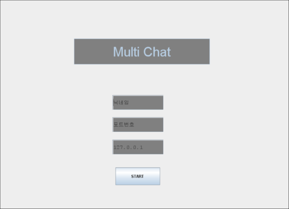
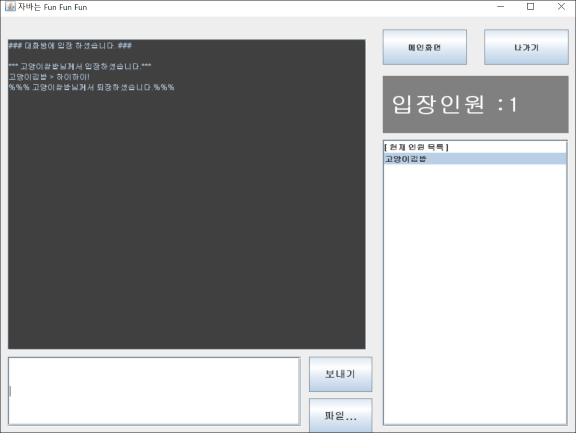

# MultiChat

✔ 멀티채팅

✔ 개발기간 : 2020.01.27 ~ 2020.02.10 (14일간)

✔ 개발인원 : 2명

✔ 담당기능

	 ▪ 메인화면 (닉네임,포트번호,IP 정보를 서버로 보내기)
	 
	 ▪ 일반채팅 보내기
	 
	 ▪ 입장/퇴장 알림

✔ Features (기능)

	 ▪ 일반채팅

	 ▪ 입장/퇴장 알림

	 ▪ 귓속말 기능
	
	 ▪ 입장인원 표시

✔ 사용언어 / 도구

	  ▪ JAVA

	  ▪ WindowBuilder(SWING)
		
	  ▪ Eclipse
	  
	 
	
# Preview 

	✍ Main
 

	👩🏻‍🤝‍👩🏻 채팅화면
 

